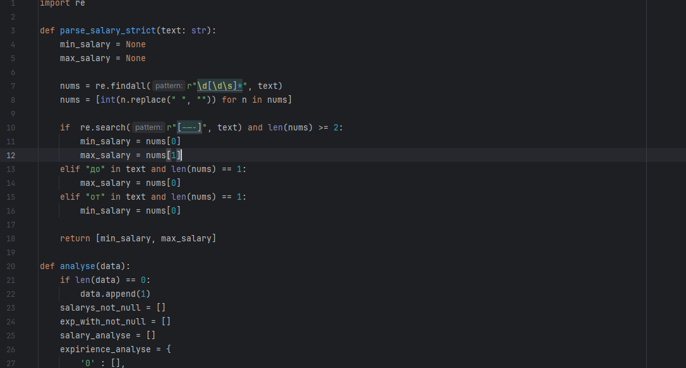
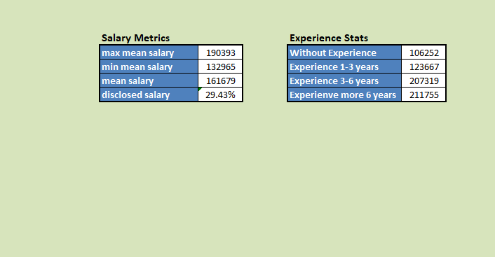
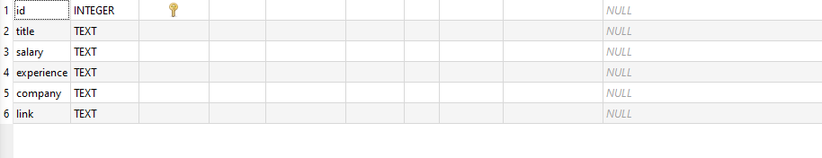
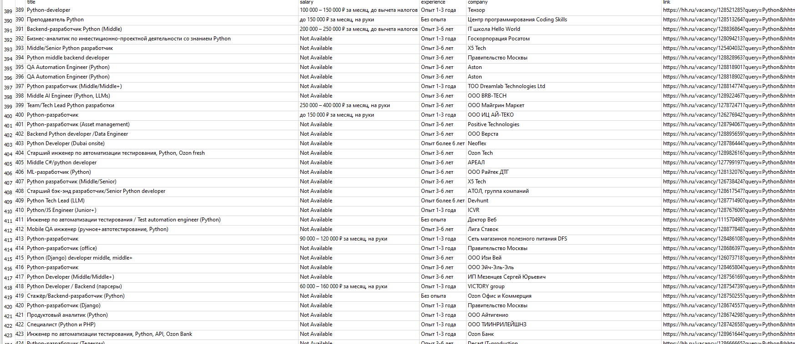

#  Web Data Parsing & Analysis Pipeline

> Modular Python project for automated web data collection, basic analysis, and structured data storage.

---

##  About the Project

This project is built to **parse data from dynamic web pages(HH.ru)**, perform **basic analytical processing**, and store the results in multiple convenient formats.

The main focus is on:
- reliable data extraction,
- clean processing flow,
- and structured output suitable for further analysis.

The project follows a **modular architecture**, making it easy to extend and maintain.

---

##  Architecture Overview

| Module | Responsibility |
|------|---------------|
| **Parser** | Web scraping, page interaction, data extraction, and workflow control |
| **Analysis** | Data cleaning, validation, and basic analytical operations |
| **Storage** | Persisting data to database and exporting results |

---

##  Project Structure

```text
Web Pages
   ↓
Data Parsing
   ↓
Cleaning & Validation
   ↓
Basic Analysis
   ↓
SQLite Database
   ↓
CSV Export → Excel Report
```

## Technologies
- Python 3+
- Selenium 
- bs4
- CSV
- SQLite
- Excel

## Usage
1. Configure target web pages
2. Run the parser
3. Review results in SQLite database or exported CSV files

## Screenshoots
- 
- 
- 
- 


`code writen by gurivake`
